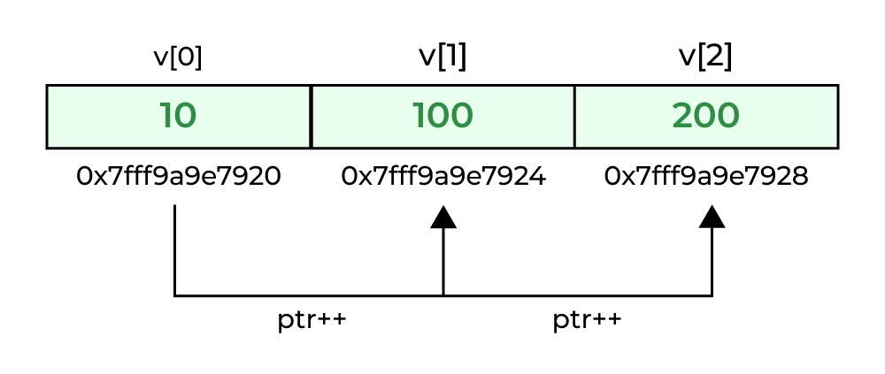
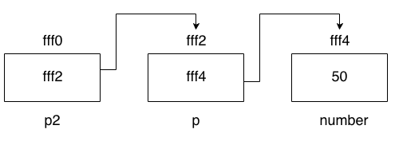

# Con trỏ (Pointer)

**Lưu ý**
Java không sử dụng con trỏ theo cách truyền thống mà sử dụng tham chiếu để quản lý bộ nhớ.

Như đã đề cập ở trên, Java không có khái niện con trỏ. Nên ta sẽ tìm hiểu về con trỏ bằng ngôn ngữ C++.

## Con trỏ là gì?

Con trỏ là một biến đặc biệt dùng để lưu trữ địa chỉ bộ nhớ của một biến khác. Thay vì lưu trữ trực tiếp giá trị của dữ liệu như các biến thông thường, con trỏ lưu trữ địa chỉ nơi dữ liệu đó được lưu trữ trong bộ nhớ.

**Giải thích về bộ nhớ và địa chỉ**

Bộ nhớ máy tính được chia thành niều ô nhớ nhỏ (memory cell), mỗi ô nhớ có một địa chỉ duy nhất (giống như số nhà trên một con phố). Một ô nhớ trong máy tính thông thường có thể lưu trữ được 1 byte(8 bit).


## Tại sao phải dùng con trỏ ?

* Hiệu xuất và Quản lý bộ nhớ vì nó truy cập trực tiếp vào địa chỉ bộ nhớ của dữ liệu, giúp tăng tốc độ truy cập dữ liệu và thực hiện các thao tác trên bộ nhớ một cách hiệu quả.
* Truyền tham chiếu vào hàm bằng con trỏ, có thể thay đổi trực tiếp giá trị của biến gốc mà không cần sao chép dữ liệu. Điều này tiết kiệm bộ nhớ và tăng hiệu suất

```cpp
void increment(int* ptr) {
    (*ptr)++;
}

int main() {
    int x = 10;
    increment(&x);  // x bây giờ là 11
}
```

## Khai báo con trỏ

Để khai báo một con trỏ, bạn sử dụng dấu * trong khai báo biến
```cpp
type * pointer_name;
```
Trong đó type là kiểu dữ liệu được trỏ tới

**Lưu ý** `*` đặt trước khi khai báo tên con trỏ chỉ có nghĩa rằng: đây là một con trỏ và hoàn toàn không liên quan gì đến toán tử Dereferencing. Đó là hai tác vụ khác nhau được biểu diễn bởi cùng một dấu

## Dereferencing – Tham chiếu giá trị qua con trỏ

Để truy cập giá trị của biến mà con trỏ trỏ đến, bạn sử dụng toán tử dereference *:

```cpp
int x = 10;
ptr = &x;// ptr trỏ đến địa chỉ của biến x
int value = *ptr;  // value bây giờ bằng 10, là giá trị của biến x
```
Khi dereference một con trỏ, bạn đang truy cập trực tiếp vào ô nhớ mà con trỏ trỏ đến.

## Address-of operator - Lấy địa chỉ của biến

Khi khai báo một biến thì nó phải được lưu vào một vị trí cụ thể trong bộ nhớ. Việc quyết định nơi nào biến đó được đặt được làm tự động bởi trình biên dịch và hệ điều hành, nhưng nếu muốn biết địa chỉ của biến đó ở đâu chúng ta có thể đặt trước tên biến toán tử `&`

```cpp
int a = 10; //Giải sử biến a được đặt ở ô nhớ 1776
int b = a;
int c = &a;

cout << b;// 10
cout << c; // 1776 
```
Những biến lưu trữ địa chỉ của một biến khác như `c` được gọi là con trỏ

## Con trỏ NULL

Một con trỏ có thể không trỏ đến địa chỉ hợp lệ nếu nó chưa được khởi tạo hoặc đã bị giải phóng. Bạn có thể gán con trỏ bằng nullptr để chỉ ra rằng nó không trỏ đến bất kỳ địa chỉ nào:

```cpp
int* ptr = nullptr;  // ptr không trỏ đến bất kỳ đâu
```

Nếu bạn cố gắng dereference một con trỏ NULL hoặc con trỏ không hợp lệ, chương trình sẽ gặp lỗi (segmentation fault).

## Con trỏ và mảng

Con trỏ và mảng có mối quan hệ mật thiết. Tên của mảng thực chất là địa chỉ của phần tử đầu tiên trong mảng.

```cpp
int arr[5] = {1, 2, 3, 4, 5};
int* ptr = arr;  // ptr trỏ đến phần tử đầu tiên của mảng
```
Trong đoạn code này `ptr` và `arr` là tương đương. Điểm khác biệt là có thể gán giá trị mới cho `ptr` trong khi `arr` luôn trỏ đến phần tử đầu tiên trong mảng. Vì vậy, không giống như `p` là một con trỏ bình thường, `arr` là một con trỏ hằng

**Ví dụ**

```cpp
    int nums[5];  // Khai báo mảng nums có 5 phần tử
    int *p;       // Khai báo con trỏ p

    p = nums;     // Gán địa chỉ của mảng nums cho con trỏ p
    *p = 10;      // Đặt giá trị của phần tử đầu tiên của mảng nums (nums[0]) = 10
    p++;          // Tăng con trỏ p lên 1, giờ p trỏ đến nums[1]
    *p = 20;      // Đặt giá trị của phần tử thứ hai của mảng nums (nums[1]) = 20
    p++;          // Tăng con trỏ p lên 1, giờ p trỏ đến nums[2]
    *p = 30;      // Đặt giá trị của phần tử thứ ba của mảng nums (nums[2]) = 30
    p = nums + 3; // Gán con trỏ p đến phần tử thứ tư của mảng nums (nums[3])
    *p = 40;      // Đặt giá trị của phần tử thứ tư của mảng nums (nums[3]) = 40
    p = nums;     // Đặt lại con trỏ p về địa chỉ đầu tiên của mảng nums
    *(p + 4) = 50; // Đặt giá trị của phần tử thứ năm của mảng nums (nums[4]) = 50

    // Mảng nums sẽ có giá trị lần lượt là [10, 20, 30, 40, 50]|
```

## Các phép tính số học với con trỏ

Việc thực hiện các phép toán với con trỏ hơi khác so với ccas kiểu dữ liệu số, chỉ phép cộng và phép trừ là được phép dùng với con trỏ, chẳng hạn như cộng hoặc trừ một giá trị để di chuyển con trỏ đến các vị trí khác nhau trong bộ nhớ. Tuy nhiên cộng và trừ đều cho kết quả phụ thuộc vào kích thước của kiểu dữ liệu mà con trỏ đó trỏ tới:

```cpp
char *myChar;// địa chỉ ô nhớ là 1000;
short *myShort;// địa chỉ ô nhớ là 2000;
long *myLong;// địa chỉ ô nhớ là 3000;

myChar++;//giá trị hiện tại sẽ là 1001
myShort++;//giá trị hiện tại sẽ là 2002
myLong++;//giá trị hiện tại sẽ là 3004
```
**Giải thích**: Khi cộng thêm 1 vào một con trỏ thì nó sẽ trỏ tới phần tử tiếp theo có cùng kiểu dữ liệu mà nó được định nghĩa, vì vậy kích thước tính bằng byte của kiểu dữ liệu nó trỏ tới sẽ được cộng thêm vào biến con trỏ




## Con trỏ trỏ tới con trỏ

Bạn có thể sử dụng các con trỏ trỏ tới các con trỏ khác giống như trỏ tới dữ liệu. Để làm việc đó chỉ cần thêm một dấu * cho mỗi mức tham chiếu.



```cpp
int number;//Địa chỉ ô nhớ là fff4
int *p;// Địa chỉ ô nhớ là fff2
int **p2;// Địa chỉ ô nhớ là fff0 
number = 50;
p = &number;
p2 = &p;
```

* `p2` là một con trỏ kiểu int ** và trỏ đến địa chỉ của con trỏ `p`. Do đó, giá trị của `p2` là địa chỉ của con trỏ `p`, tức là `fff2`

* `*p2` là cách truy cập giá trị mà `p2` trỏ đến. Bởi vì p2 trỏ đến `p`, nên `*p2` sẽ lấy giá trị của `p`. Mà `p` lưu trữ địa chỉ của `number`, tức là `fff4`. Vì vậy, giá trị của `*p2` là `fff4`.

* `**p` là cách truy cập giá trị mà con trỏ `p` trỏ đến. *`p2` trỏ đến `p`, và `**p2` sẽ lấy giá trị mà `p` trỏ đến. Mà `p` trỏ đến biến `number`, và `number` có giá trị là `50`. Do đó, giá trị của `**p2` là `50`.

 
**Tại sao Java không có con trỏ**

* Java được thiết kế với mục tiêu an toàn và bảo mật. Để tránh các lỗi về bộ nhớ phổ biến như tràn bộ nhớ đệm hoặc truy cập bộ nhớ không hợp lệ. Java không cho phép trực tiếp thao tác với địa chỉ trong bộ nhớ.
* Thay vào đó Java sử dụng **tham chiếu** để quản lý và truy cập các đối tượng trong bộ nhớ.