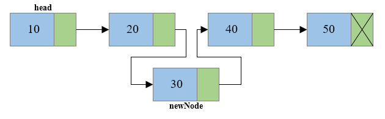

# Danh sách liên kết (Linked List)

## Singly LinkedList


**Singly Linked List** là một loại cấu trúc dữ liệu tuyến tính trong đó mỗi phần tử được liên kết với phần tử tiếp theo trong danh sách thông qua một con trỏ. Mỗi phần tử trong danh sách được gọi là một Node.

**Head** là tên gọi node đầu tiên trong LinkedList. Nếu không có node nào trong LinkedList tức LinkedList rỗng, giá trị của head thường là `null`

**Tail** là tên gọi của node cuối cùng trong LinkedList. Tail có con trỏ next trỏ đến `null` đánh dấu sự kết thúc của LinkedList

Các đặc điểm của Singly LinkedList

-   Có thể thay đổi kích thước qua việc thêm, xóa phần tử.
-   Kích thước tối đa phụ thuộc vào bộ nhớ khả dung trên RAM
-   Khác với Array các phần tử được lưu trữ ngẫu nhiên (Không liên tiếp) trong RAM

### Cài đặt Singly Linked List trong Java

#### Cấu trúc của một Node

-   Data: Chứa giá trị của phần tử.
-   Next: Con trỏ hoặc tham chiếu đến Node tiếp theo trong danh sách.

```java
class Node {
    int data;
    Node next;
    // Constructor để tạo Node
    Node(int data) {
        this.data = data;
        this.next = null;
    }
}
```

#### Các thao tác cơ bản với Singly LinkedList

[Class Demo Singly LinkedList](./DemoSinglyLinkedList.java)

1. Tạo node

```java
    public static void main(String[] args) {
        //Khởi tạo các node
        Node n1 = new Node(1);
        Node n2 = New Node(2);
        Node n3 = New Node(3);

        // Tạo tham chiếu next
        n1.next = n2;
        n2.next = n3;
    }
```

**Giải thích**
Ở đây tôi khởi tạo ra 3 node `n1`, `n2` và `n3` với giá trị lần lượt là 1, 2, 3. `n1.next = n2` tức là tôi đang kết nối node `n1` với node `n1` đồng nghĩa `n1` trỏ đến `n2`. Tương tự với `n2` và `n3`. Điều này tạo ra một chuỗi liên kết từ `n1` đến `n2` và `n2` đến `n3`.


2. Thêm một Node vào đầu danh sách danh sách

```java
public static Node addFist(Node head, int value) {
    //Tạo một node mới với giá trị được truyền vào là value
    Node newNode = new Node(value);
    if (!(head == null)) {
        newNode.next = head;
    }
    return newNode;
}
```


**Giải thích**

Nếu danh sách không rỗng (tức `head != null`), `newNode` sẽ trỏ đến `head` (Node đang là đầu của danh sách). 

Cuối cùng, node mới sẽ trở thành `head` (node đầu của danh sách), và trả về node `head` mới. 

3. Thêm một Node vào cuối danh sách

```java
public static Node addLast(Node head, int value) {
    Node newNode = new Node(value); //Tạo Node mới:
    if (head == null) {
        return newNode;
    } else {
        //Xác định node cuối cùng
        Node lastNode = head;
        while (lastNode.next != null) {
            lastNode = lastNode.next;
        }
        lastNode.next = newNode;
    }
    return head;
}
```


**Giải thích**

Nếu danh sách rỗng (tức là `head == null`), node mới sẽ trở thành node đầu tiên và duy nhất của danh sách. Còn nếu danh sách không rỗng, tôi sử dụng loop đễ tìm đến node cuối cùng (tức là node có `next` là `null`). 

Sau khi tìm được node cuối, tôi gắn next của `lastNode` vào `newNode`. 
Sau đó trả về `head` của danh sách để giữ nguyên danh sách ban đầu.


4. Thêm một Node vào giữa danh sách bằng Index

```java
public static Node addByIndex(Node head, int value, int index) {
    if (index == 0) {
        //Nếu index là 0, nghĩa là thêm node mới vào đầu danh sách
        return addFist(head, value);
    } else {
        //Tìm vị trí cần thêm
        Node newNode = new Node(value);
        Node curNode = head;
        int count = 0;
        while (curNode != null) {
            count++;
            if (count == index) {
                //Chèn node mới
                newNode.next = curNode.next;
                curNode.next = newNode;
                break;
            }
            curNode = curNode.next;
        }
        return head;
    }
}
```



**Giải thích**

Nếu index là 0 tức thêm node vào đầu dánh sách. Còn nếu index > 0, tôi sẽ duyệt qua danh sách để tìm vị trí mà tôi muốn chèn node mới (bằng cách tăng count mỗi lần duyệt qua một node).

Khi tìm được đúng vị trí (khi `count == index`), node mới sẽ được chèn vào bằng cách cập nhật các tham chiếu `next`. Sau đó trả về `head` của danh sách để giữ nguyên danh sách ban đầu.


5. Xóa một Node đầu trong danh sách

```java
public static Node removeFist(Node head) {
    //Kiểm tra danh sách không rỗng
    if (head != null) {
        //Xóa node đầu
        head = head.next;
    }
    //Trả về head mới
    return head;
}
```


**Giải thích**

Đầu tiên tôi kiểm tra danh sách đó có rỗng hay không. Nếu không rỗng, cập nhật node `head` lại thành node tiếp theo (`head = head.next`), tức là node đầu hiện tại bị loại bỏ. Sau đó trả về `head` mới, tức là node đầu sau khi xóa node cũ.

6. Xóa một Node cuối trong danh sách

```java
public static Node removeLast(Node head) {
    //Kiểm tra danh sách rỗng
    if (head == null) {
        return null;
    }
    //Xác định node cuối và node trước đó:
    Node last = head;
    Node prev = null;
    while (last.next != null) {
        prev = last;
        last = last.next;
    }
    //Xóa node cuối
    if (prev == null) {
        return null;
    } else {
        prev.next = null;
    }
    return head;
}
```


**Giải thích**

Đầu tiên nếu danh sách rỗng, tôi sẽ trả về `null`. 

Nếu không danh sách không rỗng tôi sử dụng loop để tìm `last` (node cuối cùng) và `prev` (node trước đó).

Nếu `prev == null`, tức danh sách chỉ có 1 node duy nhất thì tôi trả về `null` để xóa hết danh sách. Nếu không, tôi rán `prev.next` là `null` để cắt bỏ node cuối.

Sau đó trả về `head` với node cuối đã bị xóa


7. Xóa một Node ở giữa bằng Index


```java
public static Node removeByIndex(Node head, int index) {
    //Kiểm tra danh sách rỗng
    if (head == null) {
        return null;
    }
    //Xóa node đầu nếu index = 0:
    if (index == 0) {
        return removeFist(head);
    }
    //Tìm node cần xóa
    Node cur = head;
    Node prev = null;
    int count = 0;
    while (cur != null) {
        //Xóa node cur
        if (count == index) {
            prev.next = cur.next;
            break;
        }
        prev = cur;
        cur = cur.next;
        count++;
    }
    return head;
}
```


Nếu danh sách rỗng, tôi trả về null. 

Nếu index = 0 thì tôi gọi method `removeFirst` để xóa node đầu.

Nếu index != 0 thì tôi sử dụng Loop để tìm node `cur` (tức vị trí cần xóa) khi `count == index`. Khi tìm thấy node cần xóa. Tôi cập nhật tham chiêu next của `prev` (`prev.next = cur.next`) để xóa bỏ node này khỏi danh sách

Sau đó trả về `head`
